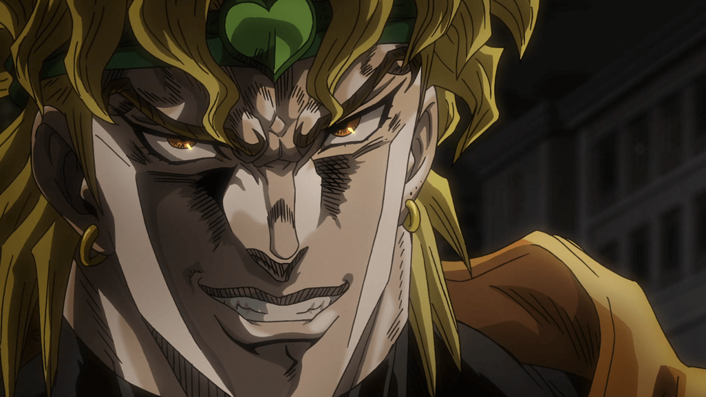

<h1 align="center">Dio the Discord Bot</h1>



<div align="center" style="margin-bottom: 15px">
  <a href="https://discord.com/api/oauth2/authorize?client_id=770575412501282826&permissions=1610083447&scope=bot%20applications.commands">Invite</a>
    ·
  <a href="#installation">Installation</a>
    ·
  <a href="#license">License</a>
    ·
  <a href="#credits">Credits</a>
</div>

## About the project

Dio is an open source JoJo's Bizarre Adventure themed discord bot created by [Mackev](https://github.com/Mackevv).

## Installation

Here is the guide to host the bot on your machine. If you just want to add the bot to your server, you can simply click on this [invite link](https://discord.com/api/oauth2/authorize?client_id=770575412501282826&permissions=1610083447&scope=bot%20applications.commands).

### Prerequisites

Before you start, make sure you have [Node.js](https://nodejs.org/en/) and [Git](https://git-scm.com) installed.

1. Clone the repo
   ```sh
   git clone https://github.com/Mackevv/DioBot.git
   ```
2. Move in the folder that Git has just created
   ```sh
   cd DioBot
   ```
3. Install dependencies
   ```sh
   npm install
   ```

### Launch the bot

- Rename the config file `config.example.js` to `config.js` and fill it with your information. 

- Run the bot with `npm start`.

## License

DioBot is released under the MIT License. See `LICENSE` for more information.

## Credits
Thanks to [Androz2091](https://github.com/Androz2091) and his open source project [AtlantaBot](https://github.com/Androz2091/AtlantaBot) who help me a lot to create my own bot.